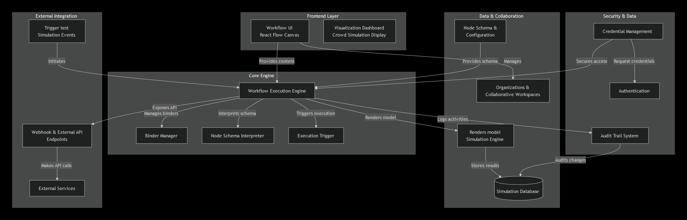
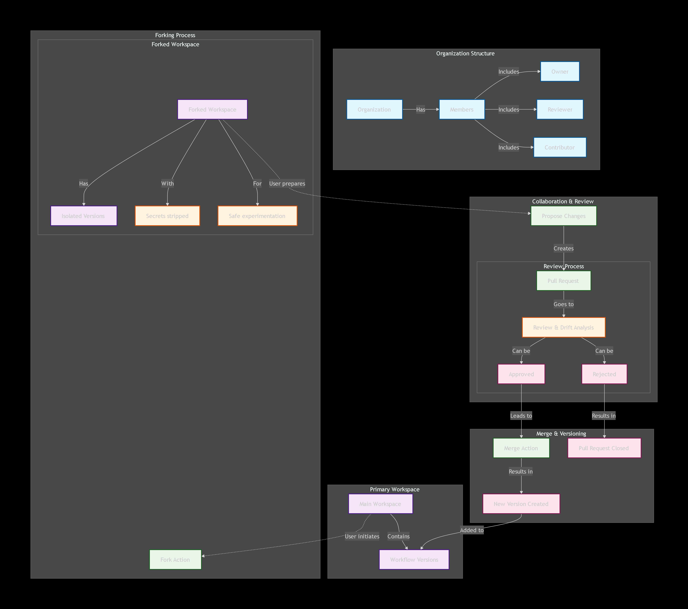
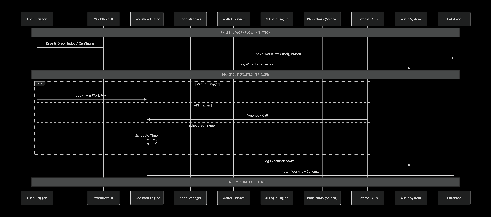

# Introduction
Crowd-Safety-Sim is an AI-powered crowd management and safety simulation platform designed for large venues, public events, and urban environments where managing crowd density is critical to preventing accidents and emergencies.

The platform enables users to create realistic digital twins of physical spaces and simulate crowd movement using intelligent agents that respond dynamically to congestion, pathways, and exit capacities. By combining real-time simulation with predictive analytics, Crowd-Safety-Sim allows planners and authorities to visualize crowd behavior, identify high-risk zones, and evaluate safety strategies before deploying them in the real world.

To move beyond passive monitoring, Crowd-Safety-Sim integrates an AI-driven intervention layer based on reinforcement learning. This system actively learns optimal strategies—such as controlling inflow, rerouting movement, or managing exits—to reduce unsafe densities and improve evacuation outcomes. All simulations and interventions are tracked transparently, enabling clear comparison between baseline scenarios and AI-assisted decision making.

Crowd-Safety-Sim provides a comprehensive platform for designing, simulating, and optimizing crowd safety using interactive dashboards, visual heatmaps, and intelligent automation—helping decision-makers ensure safer, more resilient public spaces with confidence.

# Why this exists (Problem)
Large venues (stadiums, railway stations, festivals) often react *after* dangerous crowding happens. Our platform simulates crowds using a digital‑twin venue graph and applies an RL policy to recommend/execute interventions (reroute, reduce inflow, temporary closures) before a stampede forms.

# Tech Stack
  ## Core Framework & Language

  - Python – Primary language for simulation, AI logic, and backend services

  - FastAPI – High-performance backend framework for building REST APIs

  - JavaScript / TypeScript – Frontend logic and type-safe development

  ## Simulation & Modeling

  - Custom Crowd Simulation Engine – Agent-based crowd movement modeling

  - Graph-Based Venue Modeling – Digital twin representation of real-world spaces

  - Shortest Path Algorithms – Navigation logic for crowd agents

  - Density & Flow Metrics – Real-time calculation of congestion and safety thresholds

  ## Computer Vision & Layout Extraction

   ### OpenCV (Python)
    - Static venue image processing (floor plans, maps, photos)
    - Walkable vs non-walkable area segmentation
    - Corridor, boundary, and obstacle detection
    - Exit and bottleneck identification
    - Image-assisted digital twin initialization

  ## AI & Machine Learning

  - Reinforcement Learning (Q-Learning) – AI-driven intervention strategy learning

  - NumPy – Numerical computations for simulation and learning

  - Custom Reward Functions – Optimized for crowd safety and evacuation efficiency

  ## Backend & API

  - FastAPI REST Services – Simulation control, AI actions, and data exchange

  - JSON-based APIs – Lightweight communication between frontend and backend

  - Python Modular Architecture – Separation of simulation, AI, and API layers

  ## Frontend & Visualization

  - React – Interactive user interface

  - Tailwind CSS – Utility-first styling for rapid UI development

  - Heatmap Visualizations – Real-time crowd density representation

  - Scenario Builder UI – Configure venues, crowd size, and inflow parameters

  ## Data Handling

  - JSON Configuration Files – Venue layouts, simulation parameters, and results

  - In-Memory State Management – Fast simulation iteration and comparison

  ## System Architecture

  - Baseline vs AI-Controlled Comparison – Performance benchmarking

  - Modular Design – Easily extensible for advanced RL models or real-world sensor data

  - Digital Twin Architecture – Mirrors physical crowd environments for safe testing

  - Development & Tooling

  - Git & GitHub – Version control and collaboration

  - VS Code – Primary development environment

  - Python Virtual Environments – Dependency isolation

  - Built to simulate, predict, and prevent crowd safety risks using AI-powered digital twins and intelligent interventions.

## Crowd Safety Simulation System - Visual Overview

### B) DFD: AI vs Baseline Comparison
User (UI) 
  → POST /simulation/compare (scenario + spawn config) 
Backend 
  → load RL model 
  → run_baseline() 
  → run_optimized() (apply actions while stepping) 
  → return comparison report (metrics + action samples) 

### C) RL Decision Loop (Policy Control)
For each simulation step:
  1) read node densities
  2) discretize state (density bucket + occupancy bucket)
  3) choose action (policy exploitation)
  4) apply intervention (wait time / reroute / inflow control)
  5) step simulation

(See /docs/flows.md for expanded flow diagrams.)

---

# Inputs & Outputs  
## Inputs

Venue Layout (Digital Twin) – Zones, paths, exits, and capacities

Crowd Parameters – Crowd size, inflow rate, entry points

Simulation Settings – Time steps, duration, safety thresholds

AI Configuration – State space, action space, reward parameters

## Outputs

Crowd Density Metrics – Density per zone over time

Evacuation Statistics – Total evacuation time and flow rates

Safety Indicators – Congestion and threshold violations

AI Decisions – Selected interventions and performance metrics

Visualization Data – Heatmaps and comparison results

## Computer Vision–Assisted Venue Layout Generation (OpenCV)

Crowd-Safety-Sim integrates **OpenCV-based computer vision** to assist in transforming
**static venue images** (floor plans, maps, aerial photos) into
**simulation-ready digital twin layouts**.

This module reduces manual configuration effort by extracting spatial
structure directly from images and converting it into graph-based
representations used by the simulation engine.

> ⚠️ This system operates **only on static images** and does **not**
> perform real-time monitoring, surveillance, or individual tracking.

### OpenCV Image-to-Layout Pipeline (Offline)

OpenCV is applied **before simulation begins** to assist venue modeling:

- Image preprocessing
  - Grayscale conversion
  - Noise reduction
  - Perspective correction (optional)

- Structural feature extraction
  - Edge detection (walls, boundaries)
  - Contour detection (zones and open areas)
  - Corridor and pathway identification
  - Exit region marking

- Walkability map generation
  - Binary segmentation of walkable vs non-walkable regions
  - Obstacle masking

- Digital twin graph construction
  - Convert extracted regions into nodes and edges
  - Assign capacity estimates based on area and width

The resulting graph is directly consumed by the crowd simulation engine.

### Image-to-Digital-Twin Flow

Venue Image (Floor Plan / Photo)
        ↓
OpenCV Preprocessing
        ↓
Structural Feature Extraction
        ↓
Walkability & Zone Segmentation
        ↓
Graph-Based Digital Twin
        ↓
Crowd Simulation + AI Intervention

## Execution Model

At runtime:

Simulation and AI configurations are validated

The crowd simulation is executed step-by-step

The AI intervention layer evaluates the current state

Decisions are applied to the simulation

Outputs are generated and exposed to the frontend

## Core Principles

- Safety First – Minimize unsafe crowd density and congestion

- Predictive Intervention – Act before critical thresholds are breached

- Digital Twin Accuracy – Realistic modeling of physical venues

- AI-Driven Decisions – Reinforcement learning–based optimization

- Transparency – Clear comparison between baseline and AI-controlled runs

## Git-Based Collaboration

This project follows a standard Git-based collaboration workflow to ensure safe development, clear reviews, and stable versioning.

# Workflow Overview
| Step | Action | Description |
| :---: | :--- | :--- |
| 1 | **Fork Repository** | Contributors fork the main repository to create an isolated workspace. |
| 2 | **Create Feature Branch** | Changes are made on a separate branch inside the fork. |
| 3 | **Develop & Commit** | Features, fixes, or experiments are implemented and committed incrementally. |
| 4 | **Push Changes** | Commits are pushed to the contributor’s forked repository. |
| 5 | **Open Pull Request** | A pull request is created to propose changes to the main branch. |
| 6 | **Review Process** | Maintainers review code, suggest changes, or request improvements. |
| 7 | **Approval / Rejection** | Pull request is approved or rejected based on review feedback. |
| 8 | **Merge** | Approved changes are merged into the main branch. |
| 9 | **Version Update** | A new version or update is created after successful merge. |

## Execution Sequence

## Key Responsibilities of the Execution Engine

1) Configuration & Validation

Validate simulation and AI input configurations

Ensure safety thresholds and parameters are correctly defined

2) Simulation Control

Initialize the digital twin and crowd environment

Execute the crowd simulation step-by-step

3) AI Integration

Invoke the AI intervention layer at each timestep

Apply AI-driven actions to control crowd flow and density

4) Metrics & Monitoring

Track crowd density, flow rates, and safety violations

Update system state in real time

5) Output & Integration

Generate structured outputs for analysis and visualization

Expose simulation results through backend APIs to the frontend

# What Problem This Solves
| Risk | Mitigation |
| :--- | :--- |
| **Crowd congestion hotspots** | Real-time density tracking and heatmaps |
| **Late reaction to crowd buildup** | Predictive AI-based intervention |
| **Unsafe evacuation planning** | Simulation-based evacuation analysis |
| **Manual crowd control decisions** | Reinforcement learning–driven actions |
| **Unverifiable safety improvements** | Baseline vs AI-controlled comparison |

# What Gets Recorded During Simulation
| Event | Purpose |
| :--- | :--- |
| **Scenario initialization** | Defines venue and crowd parameters |
| **Simulation step execution** | Tracks crowd movement over time |
| **Density threshold breach** | Identifies unsafe congestion |
| **AI intervention action** | Records applied control decisions |
| **Evacuation completion** | Measures overall safety performance |
| **Result generation** | Enables analysis and visualization |

# Core Concepts
| Concept | Description |
| :--- | :--- |
| **Digital Twin** | Virtual representation of a real venue |
| **Agent-Based Modeling** | Individual crowd agents with movement logic |
| **Density Metrics** | Crowd concentration per zone |
| **Reinforcement Learning** | AI-driven decision making |
| **Intervention Actions** | Flow control and rerouting strategies |
| **Scenario Comparison** | Baseline vs AI-assisted evaluation |

# State-Based Decision Model
Only state summaries are passed to the AI layer.

| State Element | Represents |
| :--- | :--- |
| **Zone density** | Current crowd load per area |
| **Flow rate** | Movement speed between zones |
| **Exit pressure** | Congestion near exits |
| **Time step** | Simulation progression |
| **Safety score** | Overall risk indicator |

Any deviation from safe thresholds triggers AI evaluation and response.

# Simulation Execution Flow

🔹Scenario configuration is loaded

🔹Digital twin environment is initialized

🔹Crowd agents are spawned

🔹Simulation advances step-by-step

🔹AI evaluates current crowd state

🔹Intervention actions are applied

🔹Metrics and outputs are recorded

## User Authorization Model
| Action | Authorization |
| :--- | :--- |
| **Create scenario** | Authorized user |
| **Run simulation** | System-controlled |
| **Enable AI intervention** | Config-level permission |
| **View results** | Read-only access |
| **Modify parameters** | Editor-level access |

All simulation runs are traceable to configuration inputs.

## Execution Engine Responsibilities
| Responsibility | Description |
| :--- | :--- |
| **Configuration validation** | Ensures safe and valid parameters |
| **Simulation control** | Manages time steps and agents |
| **AI invocation** | Calls RL model at runtime |
| **State updates** | Maintains real-time metrics |
| **Output generation** | Produces visualization-ready data |

## Safety & Reliability Guarantees
| Guarantee | Achieved By |
| :--- | :--- |
| **Predictive safety** | AI-based early intervention |
| **Risk reduction** | Density-aware control |
| **Transparency** | Measurable simulation metrics |
| **Repeatability** | Deterministic simulation setup |
| **Cost efficiency** | Virtual testing instead of live trials |

### Privacy & Ethical Design (Computer Vision)

The computer vision module in Crowd-Safety-Sim:

- Processes **only static images**
- Does **not analyze live video streams**
- Does **not perform facial recognition**
- Does **not track individuals**
- Is used strictly for **offline infrastructure layout extraction**

This ensures the system remains privacy-preserving and compliant with
ethical AI principles.

## Case Study (1 example – for judges)

“Mahakumbh‑like” scenario replay (What‑If simulation)
We model a high‑pressure crowd movement scenario with:

   - Converging flows into a narrow corridor (bottleneck)
   - A trigger event (gate malfunction / perceived threat)
   - Panic behavior: increased inflow toward a single exit

Baseline outcome (no interventions):
  - Density spikes beyond safe threshold at the bottleneck → repeated danger violations.

With AI interventions enabled:
   - Early rerouting to alternative exits
   - Inflow throttling at corridor entry
   - Temporary closure when density becomes critical

Result: The RL policy reduces peak density and prevents violations by distributing load across multiple exits and delaying inflow before the bottleneck becomes irreversible.

## Visual Evidence (Simulation & Results)

> The following visuals are generated directly from the running system
> and are included in `/docs` for reproducibility.

# 🛡️ Real-World Deployment, Scalability & Failure Handling

This platform is designed as a **safety-critical, AI-powered decision-support system** for managing crowds in large public venues such as **stadiums, railway stations, airports, festivals, and pilgrimages**.

The architecture intentionally prioritizes **robustness, explainability, human oversight, and controlled scaling** over unchecked automation.

---

## 🌍 Real-World Usage Scenarios

### 1️ Pre-Event Planning & What-If Analysis

Before an event, venue operators can:

- Upload venue blueprints or layouts to generate a **Digital Twin**
- Simulate multiple scenarios:
  - normal crowd flow
  - peak exit rush
  - emergency triggers (fire, bomb threat, gate malfunction)
- Identify:
  - high-risk zones
  - evacuation bottlenecks
  - optimal intervention strategies

This enables **risk mitigation before crowds assemble**, rather than reactive response after danger emerges.

---

### 2️ Live Event Monitoring (Decision-Support Mode)

During live events:

- Real-time or near-real-time inputs (manual, sensors, CCTV-derived density estimates) update the Digital Twin
- The system continuously:
  - monitors density and congestion
  - detects early warning signals
  - predicts escalation trends
- The AI generates **human-interpretable recommendations**, such as:
  - reduce inflow at critical nodes
  - reroute toward alternative exits
  - apply temporary restrictions

 **Important:**  
The AI does **not** act autonomously.  
Final decisions remain with human operators, matching real-world safety systems like air-traffic control and emergency response centers.

---

### 3️ Emergency Response & Post-Incident Analysis

When emergency triggers occur:

- Crowd behavior dynamically adapts (panic, surges, blocked paths)
- The AI becomes **trigger-aware**, producing context-specific recommendations
- All states, actions, and metrics are logged

After the event:
- Reproducible case-study reports are generated
- Authorities can analyze:
  - what happened
  - why it happened
  - how early risks were detected
  - which interventions were recommended

This supports **accountability, audits, and continuous improvement**.

---

##  Scalability & Growth Handling

The platform is designed to **scale gracefully**, from small venues to city-scale deployments.

### Simulation Scalability
- Graph-based modeling (O(nodes + edges))
- Agent behavior is localized (no global synchronization)
- Supports:
  - thousands of agents per venue
  - parallel simulation of multiple venues

Future scalability options:
- zone-based sharding
- batched agent updates
- optional GPU acceleration

---

### Data & Model Scalability
- Stateless, JSON-based scenario definitions
- Offline-trained models that can be swapped without downtime
- Multi-scenario and multi-seed evaluation to prevent overfitting

This allows expansion from:
> **Single-venue simulations → national-scale infrastructure planning**

---

##  Failure Prevention & Safety Guarantees

The system is explicitly designed to **fail safely**, never catastrophically.

---

### 1️ Advisory-First Architecture

- AI recommendations do **not** directly control the environment
- No single model failure can cause physical harm
- Human operators remain in control at all times

If the AI fails → **baseline monitoring continues normally**.

---

### 2️ Bounded Interventions (Future Phases)

When limited automation is introduced:
- Actions are:
  - reversible
  - rate-limited
  - constrained by hard safety rules
- Examples:
  - temporary inflow throttling
  - controlled gate redirection
- Automatic rollback if instability is detected

There is **no possibility of runaway behavior** by design.

---

### 3️ Graceful Degradation

If any subsystem fails:

| Subsystem Failure | Fallback Behavior |
|------------------|------------------|
| Photo-to-Layout | Manual venue configuration |
| Trigger detection | Density-based alerts continue |
| Policy engine | Baseline monitoring remains active |

There is **no single point of catastrophic failure**.

---

##  Avoiding Common AI Failure Modes

The platform intentionally avoids known AI risks:

###  No Over-Automation
- No hidden control loops
- No autonomous physical actions
- No black-box decisions without explanations

---

###  No Metric Gaming
- Advisory systems are **not falsely credited** with physical improvements
- Evaluation cleanly separates:
  - detection quality
  - recommendation stability
  - physical outcomes (only when control exists)

---

###  No Silent Model Drift
- Multi-seed evaluation
- Reproducible scenario replay
- Versioned models with downloadable reports

This ensures **long-term reliability**, not short-term demos.

---

##  Ethical & Regulatory Alignment

The platform aligns with real-world public-safety requirements:

- Human-in-the-loop operation
- Transparent and explainable AI decisions
- Full audit logs
- Reproducible evaluation

This makes it suitable for:
- public infrastructure authorities
- disaster management agencies
- safety-critical deployments

---

## 🏁 Summary

This Crowd Safety Platform is **not designed to replace humans**,  
but to **augment human decision-making under extreme pressure**.

By combining:
- Digital Twins
- Trigger-aware simulations
- Explainable AI
- Controlled scalability

the system provides a **realistic, deployable path** toward safer public spaces — without compromising accountability, trust, or ethics.

.png)

