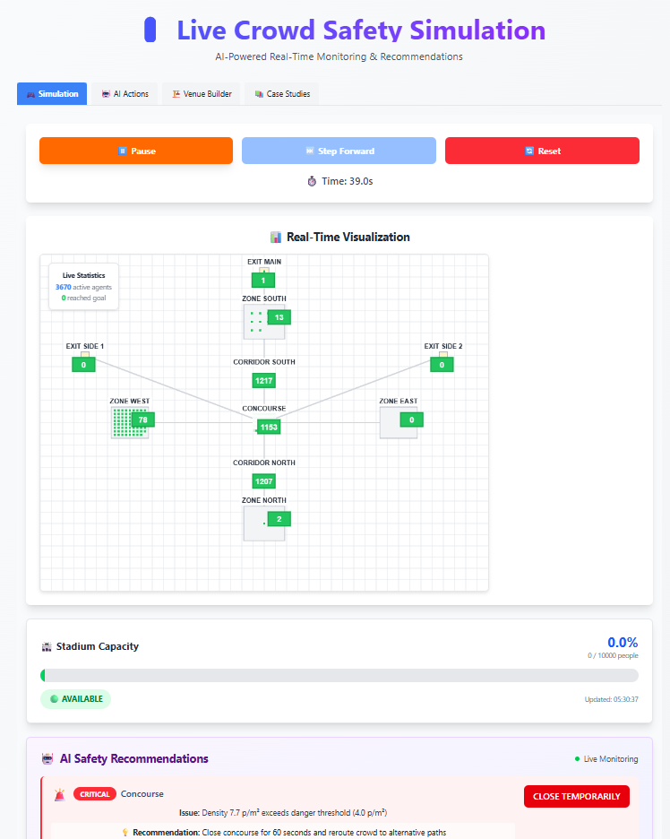
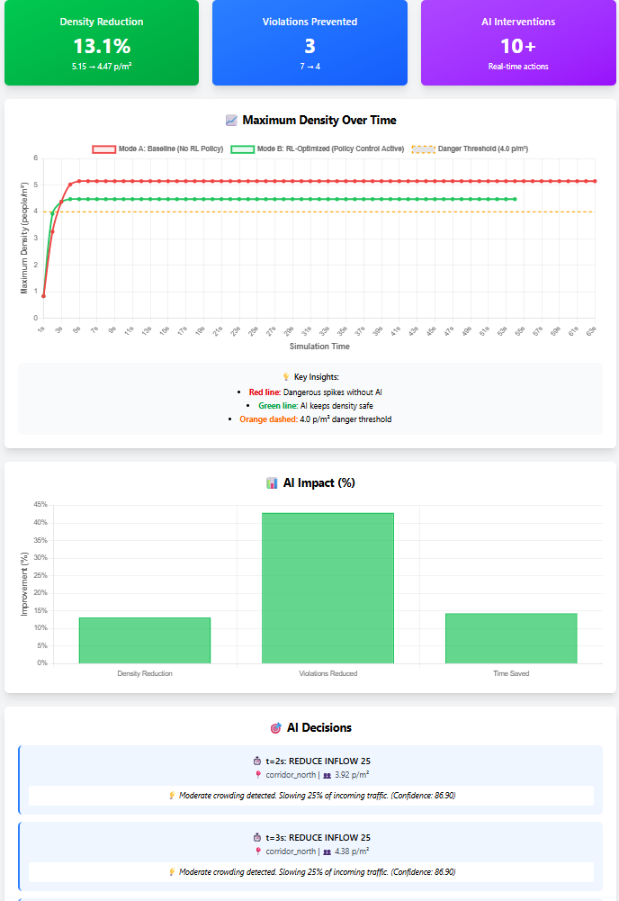

# AI‑Powered Crowd Safety Platform (Domain: AI / Machine Learning)
Predictive AI for stampede prevention + real‑time crowd flow interventions

## Why this exists (Problem)
Large venues (stadiums, railway stations, festivals) often react *after* dangerous crowding happens. Our platform simulates crowds using a digital‑twin venue graph and applies an RL policy to recommend/execute interventions (reroute, reduce inflow, temporary closures) before a stampede forms.

## What we built (Round 1)
### 1) Digital Twin + Multi‑Agent Simulation (Backend)
- Venue modeled as a **graph**: nodes = zones/exits/corridors, edges = paths with capacity/width.
- Crowd modeled as **agents** that navigate via shortest paths and slow down under high density.
- Real‑time metrics: max density, agents evacuated, danger zones, violations.

### 2) AI Intervention Layer (Q‑Learning)
- To move beyond passive monitoring, we introduce an AI-driven intervention layer that actively controls crowd flow in real time.

- The problem is inherently sequential:
every action (rerouting, inflow reduction, gate closure) affects how the crowd evolves in the next moments.
Because of this, the system is modeled using Reinforcement Learning (RL).
**For Round 1, we implemented a Q-Learning–based policy that:**
- observes crowd density and occupancy states
- selects from a small set of human-interpretable interventions
- optimizes for safety metrics such as peak density, violations, and evacuation time
- This approach allows the platform to learn intervention timing, not just react to thresholds.
- The focus in Round 1 is to validate the idea: that policy-based AI control can outperform passive or rule-based crowd monitoring.

**Roadmap**
- In subsequent rounds, this RL layer will be extended to Deep RL (DQN / PPO) to support:
- larger venues
- continuous state representations
- trigger-aware optimization (panic, surges, blockages)

(Planned enhancements are detailed in ROADMAP.md.)

### 3) Frontend Dashboard (React)
- Live heatmap visualization (node density color map)
- Scenario builder UI (design zones, connect edges, mark exits)
- “AI vs Baseline” comparison dashboard with charts + action timeline

---

## System Architecture (High level)
Frontend (React + Tailwind)
  ↕ REST API
Backend (FastAPI + Python)
  ├─ Simulation Engine (multi-agent loop)
  ├─ Digital Twin (graph topology + density stats)
  ├─ RL Agent (Q-learning policy)
  └─ Comparison Runner (baseline vs optimized)

---

## Flow Charts / DFDs (mandatory)

### A) DFD: Live Simulation (Level 1)
User (UI)
  → POST /simulation/create (scenario + spawn config)
Backend (FastAPI)
  → creates Simulator(session_id)
  → returns initial state
User (UI)
  → POST /simulation/step (session_id, steps)
Backend
  → sim.step() updates agents, densities, stats
  → returns updated state
UI
  → renders heatmap + agents + alerts

### B) DFD: AI vs Baseline Comparison
User (UI)
  → POST /simulation/compare (scenario + spawn config)
Backend
  → load RL model
  → run_baseline()
  → run_optimized() (apply actions while stepping)
  → return comparison report (metrics + action samples)

### C) RL Decision Loop (Policy Control)
For each simulation step:
  1) read node densities
  2) discretize state (density bucket + occupancy bucket)
  3) choose action (policy exploitation)
  4) apply intervention (wait time / reroute / inflow control)
  5) step simulation

(See /docs/flows.md for expanded flow diagrams.)

---

## Key Results (Round 1 – Verified)
### Stadium Exit Stress Test (1100 agents)
**Baseline (No AI)**
- Max density: 5.00 p/m²
- Danger violations: 7
- Evacuation time: 59s
- Agents reached goal: 1100

**RL‑Optimized**
- Max density: 4.575 p/m²
- Danger violations: 5
- Evacuation time: 55s
- Agents reached goal: 1100

**Improvement**
- Prevented sustained density beyond 4.5 p/m².”
- Violations prevented: 2
- Time saved: 4s

Sample AI actions:
- t=2s `reroute_to_alt_exit` @ corridor_north (density 3.125)
- t=6s `reduce_inflow_50` @ corridor_north (density 4.575)

---

## Extended Evaluation (Backend Logs)

To validate robustness, the RL policy was evaluated across multiple runs
with different random seeds and spawn patterns.

Summary (from backend evaluation logs):

- Runs: 20
- Mean max-density reduction: 7.9% (±1.1%)
- Violations reduced in: 18 / 20 runs
- No regressions observed vs baseline

  

## What makes this original
- **Digital twin + RL policy control**: Instead of only showing density heatmaps, we add a policy that *acts* on the system and can be compared vs baseline.
- **Human‑interpretable interventions**: Actions are explainable (“reduce inflow 25%”, “reroute to alt exits”) and logged with timestamps, so operators can trust it.
- **Scenario builder approach**: Instead of hardcoding one stadium, the UI supports building venue graphs and testing interventions.

---

## How to run locally
### Backend
cd backend
python -m venv venv
venv\Scripts\activate # Windows
pip install -r requirements.txt
uvicorn main:app --reload --port 8000

### Frontend
cd frontend
npm install
npm run dev

Open: http://localhost:5173 

---

## API Endpoints (Core)
- GET `/scenarios`
- POST `/simulation/create`
- POST `/simulation/step`
- GET `/simulation/{id}/state`
- GET `/simulation/{id}/graph`
- GET `/simulation/{id}/stadium-status`
- POST `/simulation/compare`

---

## Round 2 – Improvements Planned

  Improvment Plan in ROADMAP.md file

---

## Case Study (1 example – for judges)
### “Mahakumbh‑like” scenario replay (What‑If simulation)
We model a high‑pressure crowd movement scenario with:
- Converging flows into a narrow corridor (bottleneck)
- A trigger event (gate malfunction / perceived threat)
- Panic behavior: increased inflow toward a single exit

**Baseline outcome (no interventions):**
- Density spikes beyond safe threshold at the bottleneck → repeated danger violations.

**With AI interventions enabled:**
- Early rerouting to alternative exits
- Inflow throttling at corridor entry
- Temporary closure when density becomes critical

**Result:**
The RL policy reduces peak density and prevents violations by distributing load across multiple exits and delaying inflow before the bottleneck becomes irreversible.

(For Round 2, we will attach a full reproducible “Mahakumbh case pack”: scenario JSON + run logs + comparison report + dashboard screenshots.)

---

## Project Structure (important folders)
backend/
  main.py            # FastAPI API
  simulation/        # simulator, digital twin, agents, scenarios
  rl/                # q-learning agent, training, comparison runner
  ai/                # Reserved for future model extensions
frontend/
  src/components/    # canvas view, scenario builder, dashboards
docs/
  flows.md           # technical flows/DFDs
  Rl_training_history

---

### CONTRIBUTIONS

## Member1 -> Frontend
## Member2 -> Backend
## Member3 -> RL training and Comparisons
## Member4 -> Research and Documentations

## Visual Evidence (Simulation & Results)

> The following visuals are generated directly from the running system
> and are included in `/docs` for reproducibility.

.png)

